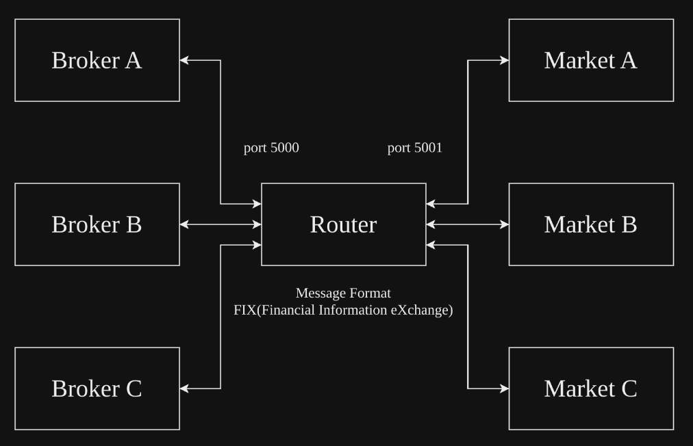
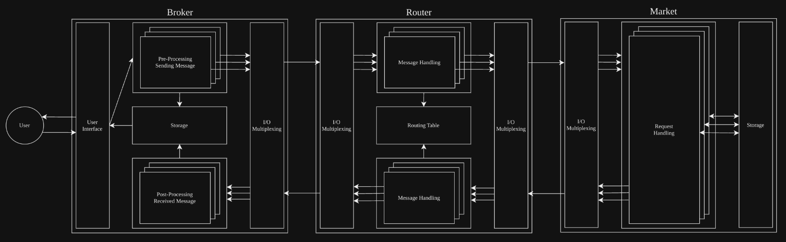

# fixme
Simulation tools for the financial markets

## Overview

## Action

## [FIX(Financial Information eXchange) Message Format](https://en.wikipedia.org/wiki/Financial_Information_eXchange)
- ID(1)
- MsgType(2)
- Instrument(3)
- Quantity(4)
- Price(5)
- Market(6)
- BrokerID(7)
- Checksum(8)

### Examples

## Communication
