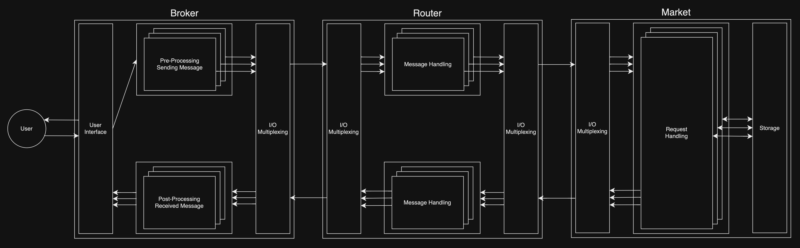

# fixme
Simulation tools for the financial markets

## Overview

## Action

## FIX(Financial Information eXchange) Message Format
- ID(1)
- MsgType(2)
- Instrument(3)
- Quantity(4)
- Price(5)
- Market(6)
- BrokerID(7)
- Checksum(8)

### Examples

## Communication

## References
- [Socket](https://docs.oracle.com/javase/8/docs/api/java/net/Socket.html)
- [Server Socket](https://docs.oracle.com/javase/8/docs/api/java/net/ServerSocket.html)
- [Selector](https://docs.oracle.com/javase/7/docs/api///java/nio/channels/Selector.html)
- [Executors](https://docs.oracle.com/javase/tutorial/essential/concurrency/executors.html)
- [FIX Protocol](https://en.wikipedia.org/wiki/Financial_Information_eXchange)
- [JDBC](https://docs.oracle.com/javase/tutorial/jdbc/basics/index.html)